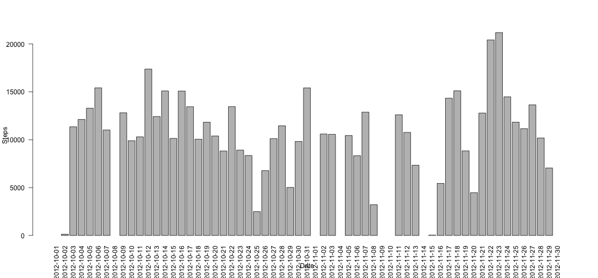
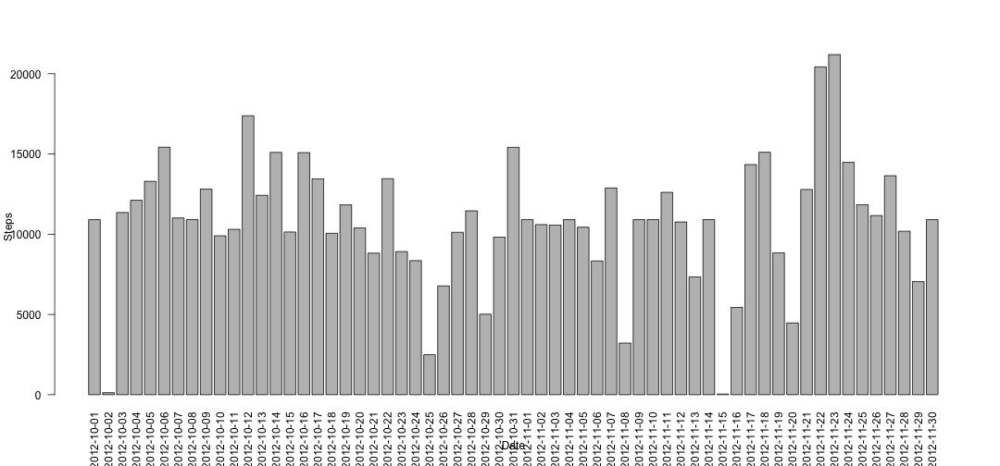
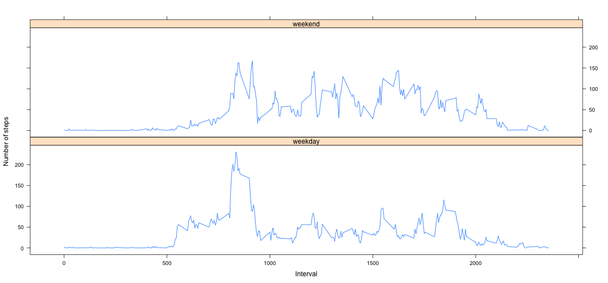

# Reproducible Research: Peer Assessment 1


## Loading and preprocessing the data
>Show any code that is needed to
 1. Load the data (i.e. read.csv())
 2. Process/transform the data (if necessary) into a format suitable for your analysis


```r
unzip("activity.zip")
originalData <- read.csv("activity.csv")
```

Head of the original dataset is as follows:

```
##   steps       date interval
## 1    NA 2012-10-01        0
## 2    NA 2012-10-01        5
## 3    NA 2012-10-01       10
## 4    NA 2012-10-01       15
## 5    NA 2012-10-01       20
## 6    NA 2012-10-01       25
```

## What is mean total number of steps taken per day?
>For this part of the assignment, you can ignore the missing values in the dataset.
 1. Make a histogram of the total number of steps taken each day
 2. Calculate and report the mean and median total number of steps taken per day

1 Create a new data set using aggregate function that aggregates steps per day & create bar plots. 

  
  ```r
  stepsPerDayData <- aggregate(originalData$steps, list(originalData$date), sum)
  colnames(stepsPerDayData) <- c("date", "steps")
  head(stepsPerDayData)
  ```
  
  ```
  ##         date steps
  ## 1 2012-10-01    NA
  ## 2 2012-10-02   126
  ## 3 2012-10-03 11352
  ## 4 2012-10-04 12116
  ## 5 2012-10-05 13294
  ## 6 2012-10-06 15420
  ```
  Create Barplot/Histogram:

  
  ```r
     barplot(stepsPerDayData$steps, names.arg=stepsPerDayData$date, xlab="Date", ylab="Steps",las=2)
  ```
  
   

2. Calculate the mean and median values (ignoring NA values) using the above dataset.

  1. Mean
      
      ```r
      dailyStepMean <- mean(stepsPerDayData$steps, na.rm=TRUE)
      ```
      
      ```
      ## [1] 10766.19
      ```
  2. Median
      
      ```r
      dailyStepMedian <- median(stepsPerDayData$steps, na.rm=TRUE)
      ```
      
      ```
      ## [1] 10765
      ```

## What is the average daily activity pattern?
>What is the average daily activity pattern?
 1. Make a time series plot (i.e. type = "l") of the 5-minute interval (x-axis) and the average number of steps taken, averaged across all days (y-axis)
 2. Which 5-minute interval, on average across all the days in the dataset, contains the maximum number of steps?

1. A Time-Series plot is created from the above dataset

  
  ```r
  stepsIntervalData <- aggregate(steps ~ interval, data=originalData, FUN=mean)
  ```
  
  ```r
  plot(stepsIntervalData, type="l")
  ```
  
   
  
2. Finding the 5-minute interval with the maximum number of steps

  
  ```r
  intervalMax <- intervalSteps[intervalSteps$AvgStepsAvgAcrossDay==max(intervalSteps$AvgStepsAvgAcrossDay),]
  ```
  
  ```
  ##     Interval AvgStepsAvgAcrossDay
  ## 104      835             206.1698
  ```
  The interval **835** - **840** has the max num of steps.


## Imputing missing values
>Note that there are a number of days/intervals where there are missing values (coded as NA). The presence of missing days may introduce bias into some calculations or summaries of the data.
 1. Calculate and report the total number of missing values in the dataset (i.e. the total number of rows with NAs)

  
  ```r
  countNA <- nrow(subset(originalData, is.na(originalData$steps)))
  ```
  
  ```
  ## [1] 2304
  ```

>Devise a strategy for filling in all of the missing values in the dataset. The strategy does not need to be sophisticated. For example, you could use the mean/median for that day, or the mean for that 5-minute interval, etc.

  Replace NAs with average 5-minute interval values from the prevous section as below. 
  
    
    ```r
    stepValues <- data.frame(originalData$steps)
    stepValues[is.na(stepValues),] <- ceiling(tapply(X=originalData$steps,INDEX=originalData$interval,FUN=mean,na.rm=TRUE))
      newData <- cbind(stepValues, originalData[,2:3])
      colnames(newData) <- c("steps", "date", "interval")
    ```
  
  Head of new dataset is as follows:
  
  ```
  ##   steps       date interval
  ## 1     2 2012-10-01        0
  ## 2     1 2012-10-01        5
  ## 3     1 2012-10-01       10
  ## 4     1 2012-10-01       15
  ## 5     1 2012-10-01       20
  ## 6     3 2012-10-01       25
  ```
>Create a new dataset that is equal to the original dataset but with the missing data filled in.

  
  ```r
  newDailyStepSum <- aggregate(newData$steps, list(newData$date), sum)
  ```
   Head of the new dataset is as follows:
  
  ```
  ##         date steps
  ## 1 2012-10-01 10909
  ## 2 2012-10-02   126
  ## 3 2012-10-03 11352
  ## 4 2012-10-04 12116
  ## 5 2012-10-05 13294
  ## 6 2012-10-06 15420
  ```
>Make a histogram of the total number of steps taken each day and Calculate and report the mean and median total number of steps taken per day. Do these values differ from the estimates from the first part of the assignment? What is the impact of imputing missing data on the estimates of the total daily number of steps?

  
  ```r
  barplot(newDailyStepSum$steps, names.arg=stepsPerDayData$date, xlab="Date", ylab="Steps",las=2)
  ```
  
   

>Calculate the mean and median values of this new dataset (NA values replaced with mean).
Do these values differ from the estimates from the first part of the assignment? What is the impact of imputing missing data on the estimates of the total daily number of steps?

  1. Mean
      
      ```r
      newDailyStepMean <- mean(newDailyStepSum$steps)
      ```
      
      ```
      ## [1] 10784.92
      ```
  2. Median
      
      ```r
      newDailyStepMedian <- median(newDailyStepSum$steps)
      ```
      
      ```
      ## [1] 10909
      ```
      
  Replacing missing values caused mean to increase from 10766 to 10784

  Replacing missing values caused median to increase from 10765 to 10909

## Are there differences in activity patterns between weekdays and weekends?
>For this part the weekdays() function may be of some help here. Use the dataset with the filled-in missing values for this part.Create a new factor variable in the dataset with two levels - "weekday" and "weekend" indicating whether a given date is a weekday or weekend day.

  Add a new column that tells if it's a weekday or weekend.. 

  
  ```r
  dateDayType <- data.frame(sapply(X=newData$date, FUN=function(day) {
    if (weekdays(as.Date(day)) %in% c("Monday", "Tuesday", "Wednesday", "Thursday", "Friday")) {
      day <- "weekday"
    }
    else {
      day <- "weekend"
    } 
  }))
  
  newDataWithDayType <- cbind(newData, dateDayType)
  
  colnames(newDataWithDayType) <- c("Steps", "Date", "Interval", "DayType")
  ```
  
   A portion of this dataset is as follows:
  
  ```
  ##   Steps       Date Interval DayType
  ## 1     2 2012-10-01        0 weekday
  ## 2     1 2012-10-01        5 weekday
  ## 3     1 2012-10-01       10 weekday
  ## 4     1 2012-10-01       15 weekday
  ## 5     1 2012-10-01       20 weekday
  ## 6     3 2012-10-01       25 weekday
  ```

>Make a panel plot containing a time series plot (i.e. type = "l") of the 5-minute interval (x-axis) and the average number of steps taken, averaged across all weekday days or weekend days (y-axis). The plot should look something like the following, which was creating using simulated data:

  The data is then separated into weekday or weekend and the mean (average) number of steps taken for each 5-minute interval, itself averaged across all weekday days or weekend days is calculated.

  
  ```r
  dayTypeIntervalSteps <- aggregate(
      data=newDataWithDayType,
      Steps ~ DayType + Interval,
      FUN=mean
  )
  ```
   Head of the dataset is as follows:
  
  ```
  ##   DayType Interval     Steps
  ## 1 weekday        0 2.2888889
  ## 2 weekend        0 0.2500000
  ## 3 weekday        5 0.5333333
  ## 4 weekend        5 0.1250000
  ## 5 weekday       10 0.2888889
  ## 6 weekend       10 0.1250000
  ```

  A panel plot of both weekend and weekday graphs is generated.

  
  ```r
  library("lattice")
  
  xyplot(
      type="l",
      data=dayTypeIntervalSteps,
      Steps ~ Interval | DayType,
      xlab="Interval",
      ylab="Number of steps",
      layout=c(1,2)
  )
  ```
  
   
